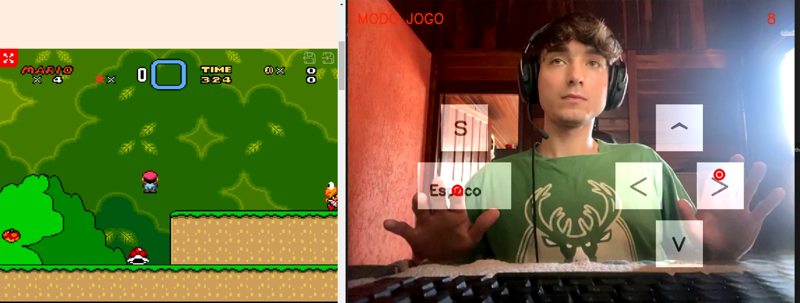

# MarioWorld-HandRecognition

MarioWorld-HandRecognition is an innovative project that allows users to play the classic Super Mario World game using hand movements. By leveraging Python programming, OpenCV, and the `mediapipe` library for advanced hand recognition, this project captures the player's hand gestures through a webcam and translates them into in-game commands.

## Features

- **Hand Movement Recognition:** Utilizes the `mediapipe` library to detect and interpret player's hand gestures, providing a unique gameplay experience.
- **Real-time Gameplay:** Seamless integration with Super Mario World, offering an immersive gaming experience.
- **Customizable Controls:** Players can customize which hand gestures correspond to specific in-game actions.

## Details

- **Institution:** FEDERAL INSTITUTE OF EDUCATION, SCIENCE AND TECHNOLOGY OF SANTA CATARINA
- **Course:** Electrical Engineering Degree
- **Subject:** Digital Image Processing
- **Student:** Elias Anzini Junior
- **Semester:** 2022/1

## Technical Details

- **Programming Language:** Python
- **Key Libraries:** OpenCV, mediapipe

## Requirements

- Python 3.x
- OpenCV
- mediapipe
- Webcam

## Installation and Execution

1. Clone this repository.
2. Navigate to the project directory.
3. Install the required libraries: `pip install -r requirements.txt`
4. Run the game interface: `python main.py`
5. Follow on-screen instructions to calibrate hand movements and start playing.

## Contributions

Contributions to enhance the gameplay experience, improve hand gesture detection accuracy, or add new features are highly appreciated. Feel free to open an issue or submit a pull request.

## License

This project is licensed under the MIT license.

## Contact

For questions, suggestions, or feedback, please contact: [eliasanzinijlle@outlook.com](mailto:eliasanzinijlle@outlook.com)

